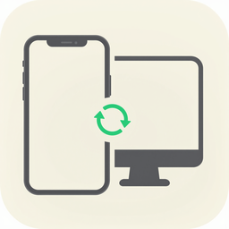

<p align="center">
  
</p>

<h1 align="center">ClipSync for Windows</h1>

<p align="center">
  <b>Phone verification codes & clipboard → Windows popups, one-click copy.</b><br/>
  <a href="README.md">简体中文</a> ·
  <a href="README.en.md">English</a> ·
  <a href="README.ja.md">日本語</a>
</p>

---

ClipSync is a self-hosted, cross-device message syncing tool. This repository contains the Windows desktop client, built with **.NET 8 + WPF (C#)**.

Core use case: **when your phone receives a verification code or you copy something, Windows immediately shows a toast with one-click copy — and vice versa, content copied on Windows is synced to your other devices in real time.**

No third-party push services are involved — all traffic goes through your own WebSocket relay, with optional end-to-end encryption. Your data stays under your control.

---

## ✨ Features

| Area | What it does |
|------|--------------|
| 📩 **SMS code toasts** | When your phone receives a code, a Windows toast pops up top-right with one-click "Copy code" and "Copy full text" buttons |
| 📋 **Bidirectional clipboard sync** | Text and images copied on this PC are auto-uploaded; clips from other devices are auto-written to the local clipboard |
| 🛡️ **Optional E2E encryption** | AES-256-GCM with PBKDF2-HMAC-SHA256 (200,000 iterations). The server only sees ciphertext |
| 🔔 **Toast notifications** | Non-focus-stealing banners, auto-dismiss after 5s, max 3 stacked. Verification codes are auto-detected with a dedicated button |
| 🖥️ **Tray resident** | Closing the main window hides to the system tray; left-click to restore, right-click for menu |
| 👥 **Online devices list** | The home view shows every device on the same account — platform, IP, and sync capabilities — in real time |
| 🚀 **Launch at startup** | One toggle in the installer or in-app; writes to `HKCU\...\Run` |
| 🧭 **First-run wizard** | Guided setup for server address, credentials, and E2EE — all in one flow |
| 📜 **History** | Last 500 messages persisted locally, with copy / delete / category filtering |
| 🔄 **Auto reconnect** | Reconnects on network drops; expired tokens are silently refreshed using saved credentials |
| 🔒 **Single instance** | A global mutex prevents duplicate processes; launching again brings the existing window to front |

---

## 🖼️ UI Overview

| Home | SMS History | Clipboard History |
|------|-------------|-------------------|
| Connection status, account, encryption, sync toggles, online devices, latest message | Chronological list with "copy code" / delete | Text and image previews with copy / delete |

---

## 📦 Download & Install

Head to [GitHub Releases](https://github.com/JH-Clipsync/ClipSync-Windows/releases) and pick the right build:

| File | Use for |
|------|---------|
| `ClipSync-Setup-<ver>-win-x64.exe` | Most Intel/AMD 64-bit Windows PCs (recommended) |
| `ClipSync-Setup-<ver>-win-arm64.exe` | ARM64 devices (Surface Pro X, Snapdragon laptops) |
| `ClipSync-<ver>-win-x64.zip` | Portable zip — unzip and run, no registry changes |

> Installers are **self-contained** — the .NET 8 runtime is bundled, so **nothing extra needs to be installed**. The default "Just Me" mode installs to `%LocalAppData%\Programs\ClipSync` without requiring admin rights.

System requirements: **Windows 10 1809 (build 17763) or later / Windows 11**.

---

## 🚀 Quick Start

1. Install and launch ClipSync
2. On first run the onboarding wizard will guide you through:
   - **Server address** (e.g. `192.168.1.10:8080`, supports `ws://` / `wss://`)
   - **Username / password** issued by your server admin (a token is fetched automatically)
   - **End-to-end encryption** — enable and set a sync password (must match across devices)
3. Click **Connect**. When the tray icon turns green, you're online.
4. Sign in with the same account on your phone ([ClipSync-Android](https://github.com/JH-Clipsync/ClipSync-Android)) to start syncing.

---

## 🧩 Project Structure

```
ClipSync-Windows/
├── src/
│   ├── ClipSync.Core/              # Cross-platform core (protocol/crypto/net/storage)
│   │   ├── Crypto/                 # AES-256-GCM + PBKDF2 with key cache
│   │   ├── Net/                    # WSClient / AuthClient / ServerAddress
│   │   ├── Protocol/               # SyncMessage / MessagePayload / code extractor
│   │   ├── Storage/                # SettingsStore / HistoryStore / AppPaths
│   │   └── Diagnostics/            # Daily-rotating file log
│   └── ClipSync.App/               # WPF application
│       ├── App.xaml / App.xaml.cs  # Entry (single-instance, tray, Dispatcher)
│       ├── MainWindow.xaml(.cs)    # Main window (left nav + content host)
│       ├── Services/
│       │   ├── ClipboardMonitor.cs # 600ms polling + image compression + dedup
│       │   ├── ClipboardWriter.cs  # Writes remote payloads to local clipboard
│       │   └── AutoStartService.cs # Startup registry toggle
│       ├── UI/
│       │   ├── HomeView.cs         # Home (status, devices, latest message)
│       │   ├── HistoryView.cs      # SMS / clipboard history
│       │   ├── SettingsView.cs     # Settings page
│       │   ├── OnboardingWizard.cs # First-run wizard
│       │   ├── ToastWindow.xaml(.cs) # Top-right toast
│       │   └── ToastManager.cs     # Stacking toasts
│       └── Resources/app.ico
├── installer/
│   ├── ClipSync.iss                # Inno Setup script (Chinese/English wizard)
│   └── assets/
└── .github/workflows/release.yml   # GitHub Actions: x64/arm64 auto release
```

### Tech Stack

- **.NET 8** + **WPF** (`net8.0-windows`)
- **C# 12** with `Nullable` and `ImplicitUsings`
- `System.Drawing.Common` / `Microsoft.Windows.Compatibility` (clipboard images + tray icon)
- `System.Text.Json` (no reflection-based serializers)
- Installer: [Inno Setup 6](https://jrsoftware.org/isinfo.php)

---

## 🔧 Building from Source

### Prerequisites

- [.NET 8 SDK](https://dotnet.microsoft.com/download/dotnet/8.0)
- Windows 10/11 (WPF requires Windows to build)

### Command line

```powershell
# Restore dependencies
dotnet restore ClipSync.sln

# Debug build
dotnet build ClipSync.sln -c Debug

# Run
dotnet run --project src/ClipSync.App/ClipSync.App.csproj

# Publish self-contained single file (x64 shown)
dotnet publish src/ClipSync.App/ClipSync.App.csproj `
  -c Release -r win-x64 --self-contained true `
  -p:PublishSingleFile=true `
  -p:IncludeNativeLibrariesForSelfExtract=true `
  -p:IncludeAllContentForSelfExtract=true `
  -p:EnableCompressionInSingleFile=true `
  -p:PublishTrimmed=false `
  -o publish/x64
```

### Visual Studio

Open `ClipSync.sln` in Visual Studio 2022 17.8+ and press F5.

### Building the installer (optional)

1. Install [Inno Setup 6](https://jrsoftware.org/isdl.php)
2. Run `dotnet publish` for x64 and/or arm64 first
3. From the repo root:

```powershell
# x64
& "C:\Program Files (x86)\Inno Setup 6\ISCC.exe" "installer\ClipSync.iss" /DArch=x64
# arm64
& "C:\Program Files (x86)\Inno Setup 6\ISCC.exe" "installer\ClipSync.iss" /DArch=arm64
```

Output: `installer/Output/ClipSync-Setup-<ver>-win-<arch>.exe`.

---

## 🔐 Privacy & Security

| Aspect | Design |
|--------|--------|
| Transport | Goes through your own server; no third parties |
| Server storage | None — messages are routed, never persisted |
| Client storage | `%APPDATA%\ClipSync\` |
| Config | `settings.json` (token + credentials, local only) |
| History | `history.json` (last 500 messages; clearable from the app) |
| Logs | `logs/clipsync-YYYY-MM-DD.log` (daily rotation) |
| E2E encryption | AES-256-GCM; key derived from your sync password via PBKDF2-HMAC-SHA256 (200k iterations), never leaves the device |
| Permission scope | Clipboard + network only — no browser, no filesystem access |
| Production tip | Put Nginx/Caddy in front for TLS (`wss://`) |

---

## 🐛 Troubleshooting

| Symptom | What to check |
|---------|---------------|
| Double-click does nothing | See `%APPDATA%\ClipSync\startup-trace.log` and `crash.log` |
| Cannot connect | Verify address/port, firewall, and that the server is running; prefer `ws://IP:port` over `localhost` |
| Messages arrive but can't be decrypted | Sync passwords differ across devices, or one side has E2EE off; check the "decrypt failure" hint on the home page |
| Clipboard not syncing | Make sure "Auto sync clipboard" is on; Windows clipboard history may interfere |
| Images not showing | Check the "Show message content" toggle; long edges are compressed to 1600px |
| Multiple windows open | Check Task Manager for a leftover `ClipSync.App.exe` process |

Logs: `%APPDATA%\ClipSync\logs\`  
Startup trace: `%APPDATA%\ClipSync\startup-trace.log`  
Crash log: `%APPDATA%\ClipSync\crash.log`

---

## 🛣️ Roadmap

- [ ] Dark theme
- [ ] Global hotkey (push current clipboard with one keystroke)
- [ ] File / folder sync
- [ ] Startup entry self-check and repair
- [ ] Auto-updater (Squirrel / Velopack)

---

## 🤝 Related Projects

| Project | Stack | Link |
|---------|-------|------|
| Server | Go + gorilla/websocket | [JH-Clipsync/ClipSync-Server](https://github.com/JH-Clipsync/ClipSync-Server) |
| macOS client | Swift + SwiftUI | [JH-Clipsync/ClipSync-Mac](https://github.com/JH-Clipsync/ClipSync-Mac) |
| Android client | Kotlin + OkHttp | [JH-Clipsync/ClipSync-Android](https://github.com/JH-Clipsync/ClipSync-Android) |

---

## 📄 License

Personal project — feel free to study, fork, and modify.

---

**Made with ❤️ · Fully self-built across all platforms · Your data stays yours**
